# MSRE CAD Models

Parametric CadQuery 3-D models for all 12 MSRE hardware components, generated from the
dimensional specifications in `components/*/specifications.md` (sourced from ORNL-TM-728).

---

## Quick Start

```bash
# Generate all 12 STEP files + PNG screenshots (takes ~2 minutes)
python3 cad/scripts/generate_all.py

# Generate a single component (e.g. component 1)
python3 cad/scripts/generate_all.py --component 1

# Or run a component script directly
python3 cad/scripts/01_reactor_vessel.py
```

**Requires:** `cadquery >= 2.7` and `matplotlib >= 3.7`
```bash
pip install cadquery matplotlib
```

---

## Directory Structure

```
cad/
├── README.md                    ← This file
├── scripts/
│   ├── render_utils.py          ← Shared render helpers (STEP export + PNG render)
│   ├── generate_all.py          ← Master pipeline: runs all 12 scripts
│   ├── 01_reactor_vessel.py
│   ├── 02_reactor_core.py
│   ├── 03_primary_heat_exchanger.py
│   ├── 04_fuel_salt_pump.py
│   ├── 05_coolant_salt_pump.py
│   ├── 06_fuel_drain_tank.py
│   ├── 07_freeze_valves.py
│   ├── 08_off_gas_system.py
│   ├── 09_control_rods.py
│   ├── 10_reactor_cell.py
│   ├── 11_coolant_radiator.py
│   └── 12_instrumentation_control.py
├── step/                        ← STEP AP214 exchange files (auto-generated)
│   ├── 01_reactor_vessel.step
│   └── … (12 files total)
├── screenshots/                 ← PNG renders, ~150 dpi (auto-generated)
│   ├── 01_reactor_vessel.png
│   └── … (12 files total)
└── cad_review/
    └── cad_review_report.md     ← msr-gstack multi-agent CAD review
```

---

## Component Gallery

| # | Component | Screenshot | STEP |
|---|-----------|-----------|------|
| 01 | Reactor Vessel | 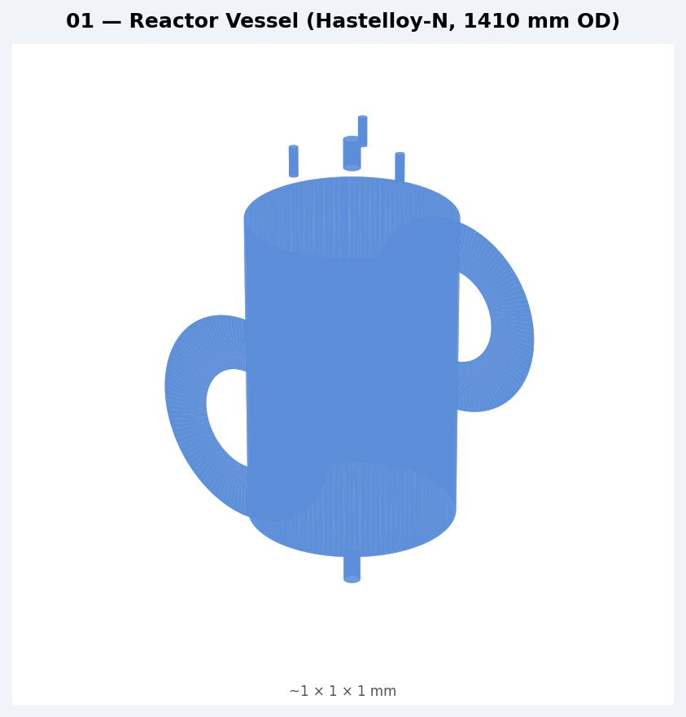 | [STEP](step/01_reactor_vessel.step) |
| 02 | Reactor Core | 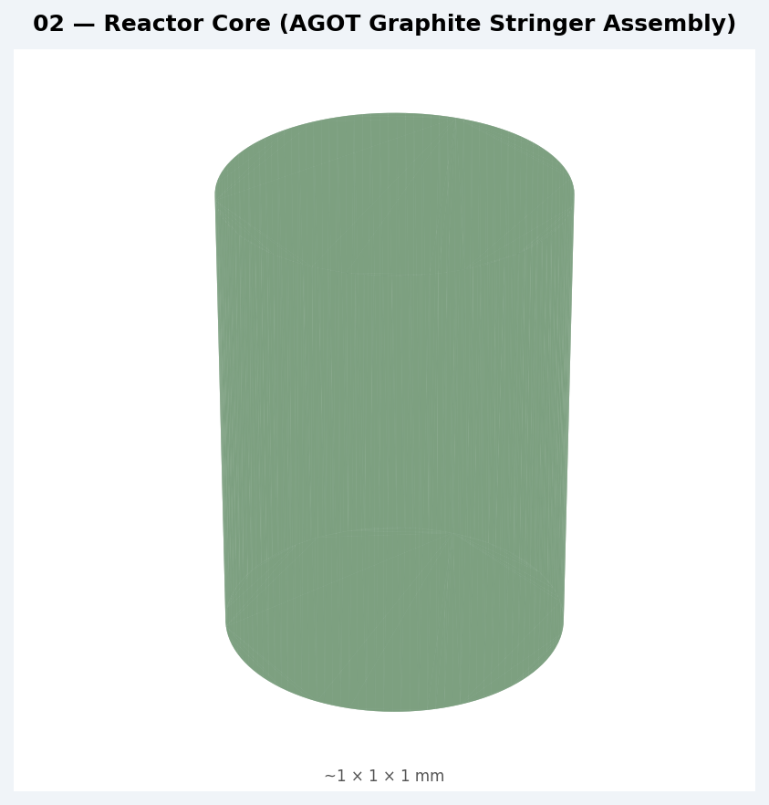 | [STEP](step/02_reactor_core.step) |
| 03 | Primary Heat Exchanger | 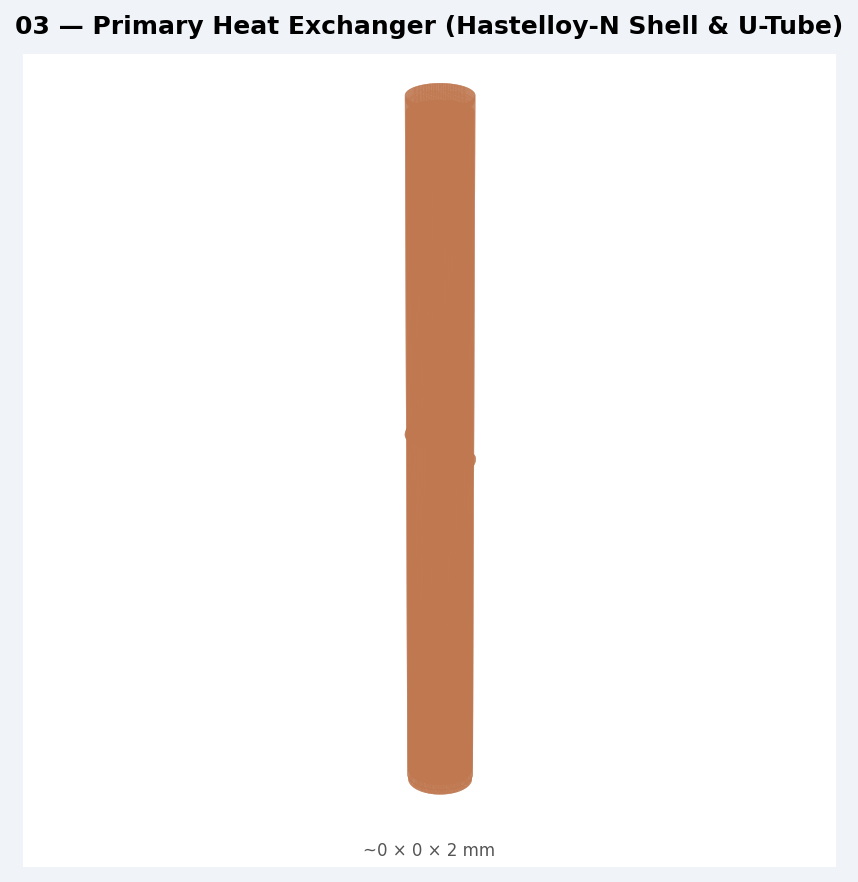 | [STEP](step/03_primary_heat_exchanger.step) |
| 04 | Fuel Salt Pump | 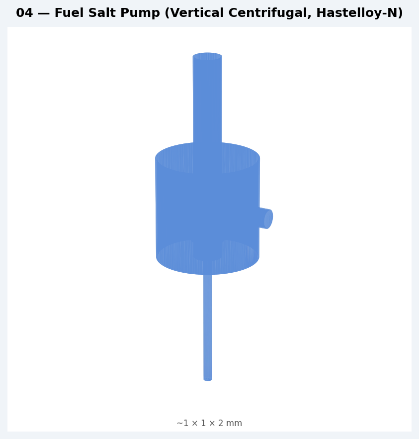 | [STEP](step/04_fuel_salt_pump.step) |
| 05 | Coolant Salt Pump | 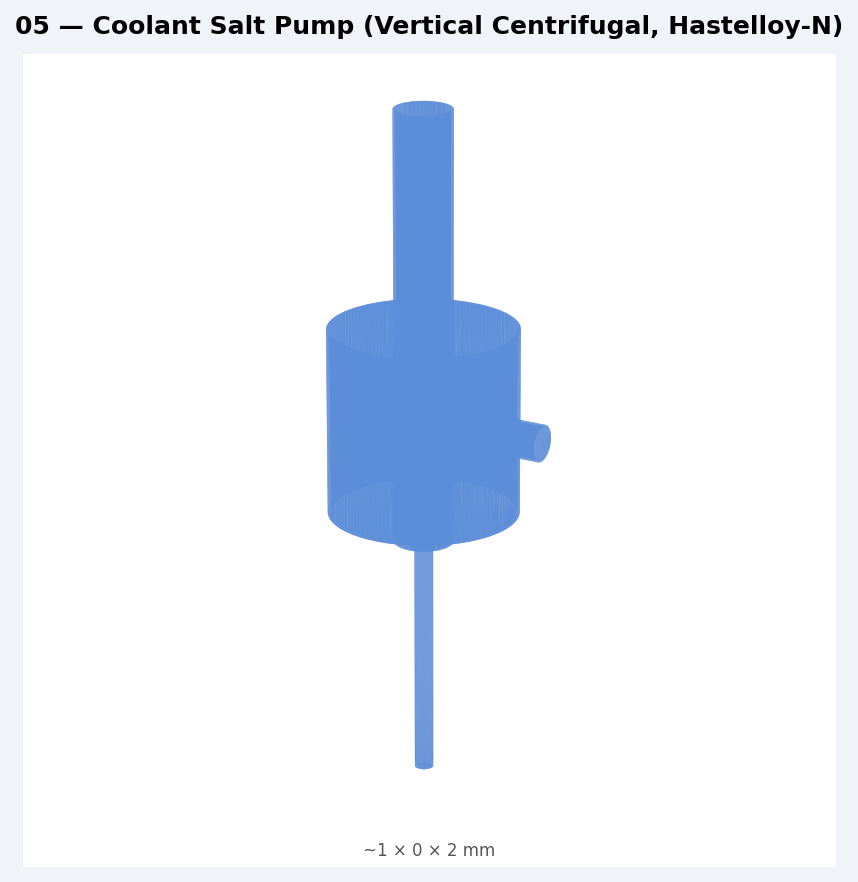 | [STEP](step/05_coolant_salt_pump.step) |
| 06 | Fuel Drain Tank | 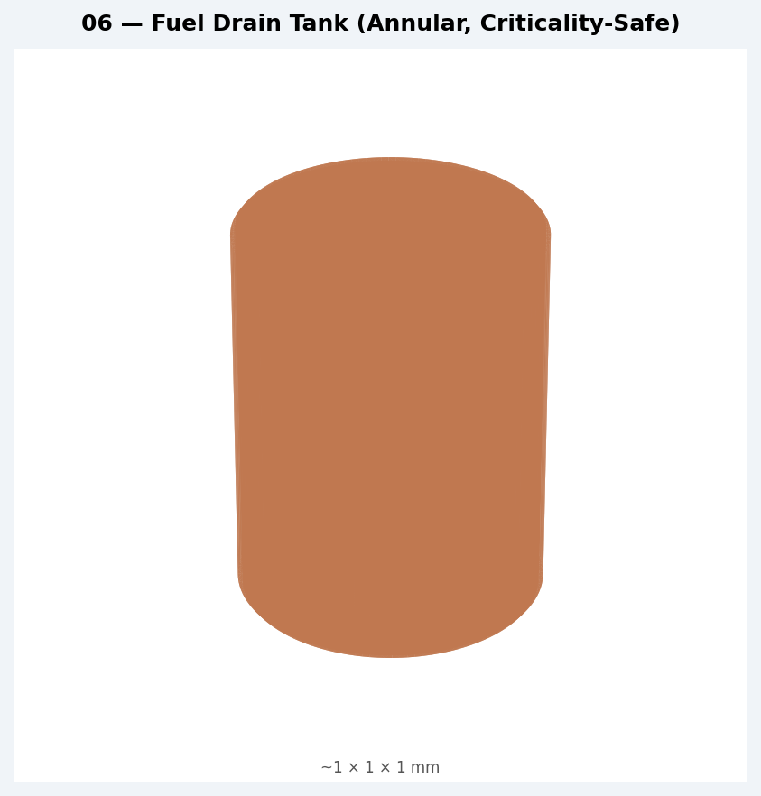 | [STEP](step/06_fuel_drain_tank.step) |
| 07 | Freeze Valves | 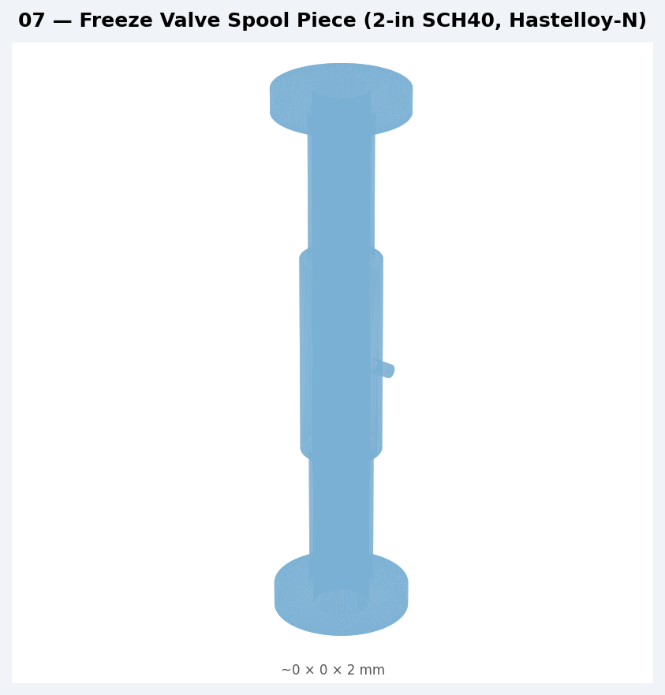 | [STEP](step/07_freeze_valves.step) |
| 08 | Off-Gas System | 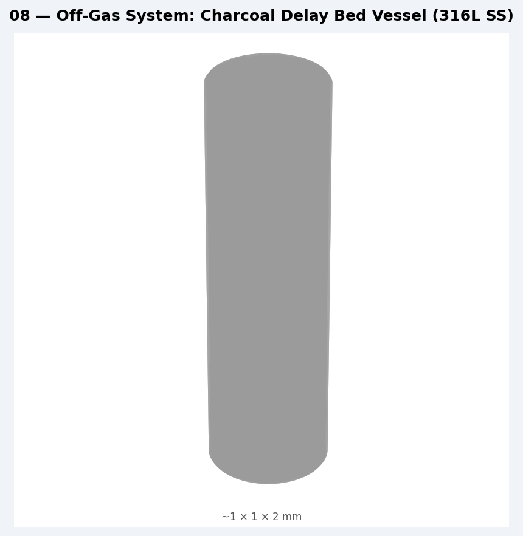 | [STEP](step/08_off_gas_system.step) |
| 09 | Control Rods | 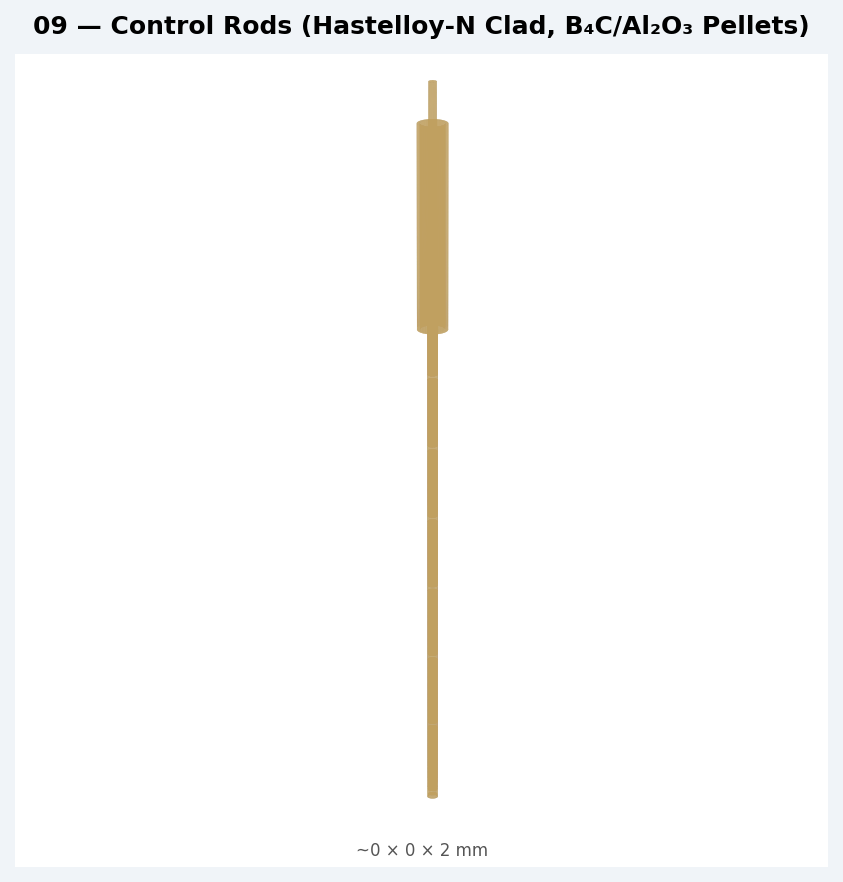 | [STEP](step/09_control_rods.step) |
| 10 | Reactor Cell | 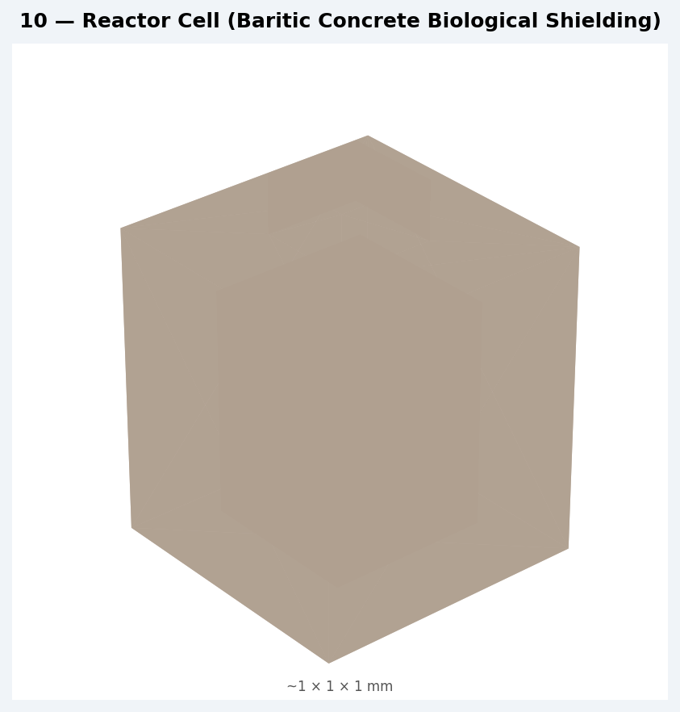 | [STEP](step/10_reactor_cell.step) |
| 11 | Coolant Radiator | 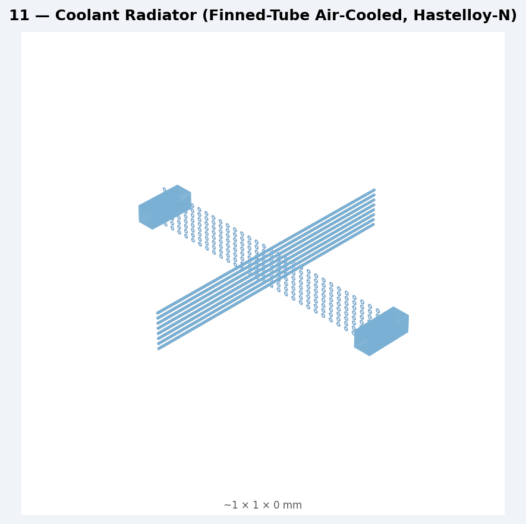 | [STEP](step/11_coolant_radiator.step) |
| 12 | Instrumentation & Control | 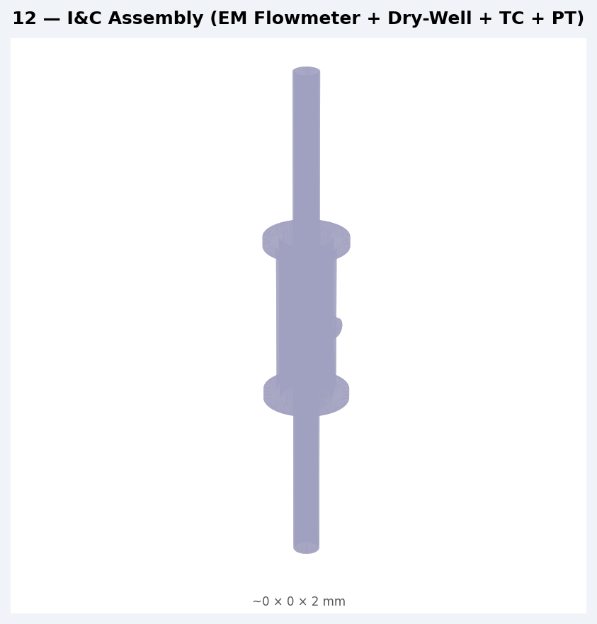 | [STEP](step/12_instrumentation_control.step) |

---

## Model Fidelity

These are **reference-grade parametric models** derived from ORNL-TM-728 dimensions. They are:

- ✅ **Dimensionally correct** — all key dimensions (OD, ID, wall thickness, lengths) match
  the specifications in `components/*/specifications.md`
- ✅ **Topologically representative** — correct number of nozzles, tube counts,
  concentric cylinders, head geometry
- ⚠️ **Simplified for reference** — internal details (weld preparations, thread forms,
  baffle geometry, exact fin profile) are simplified for clarity and render speed
- ⚠️ **Not manufacture-ready** — these are not shop drawings; use `specifications.md` for
  dimensional tolerances, surface finish, and fabrication requirements

For the radiator (component 11), the STEP file is large (~3 MB) due to the detailed
fin geometry. A simplified representation (showing 1-in-8 fins) is used.

---

## msr-gstack CAD Review

The models have been reviewed by the msr-gstack multi-agent MSR specialist system.
See [`cad_review/cad_review_report.md`](cad_review/cad_review_report.md) for the
full review output from four specialist agents:
- `/review-reactor-design` — core geometry, nozzle locations, thermal-hydraulic consistency
- `/review-safety` — criticality-safe geometry, drain tank, freeze valve dimensions
- `/review-materials` — material designations in model metadata
- `/review-instrumentation` — I&C assembly geometry, sensor positions

---

## Regenerating Models

After editing any `specifications.md` or `bom.csv`:

```bash
python3 cad/scripts/generate_all.py
```

The pipeline is deterministic and idempotent — running it again overwrites existing files
with identical output if no inputs changed.
